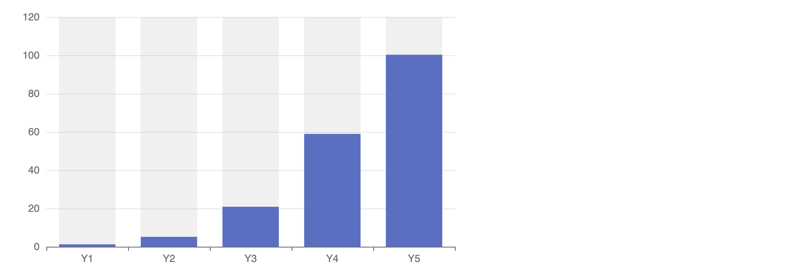
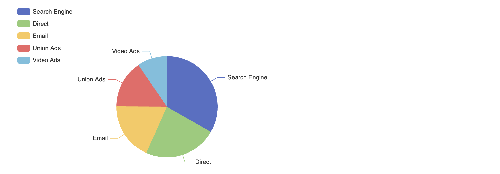

# some meta commands

### barcharts



how to represent graphs from sheet

```js

!!bizmodel.graph_bar_row rowname:revenue_total unit:million title:'A Title' title_sub:'Sub'

```

#### define period

> TODO: not working yet
> 
```js
!!bizmodel.graph_bar_row rowname:revenue_total period:3
```

period is in months, 3 means every quarter, 12 is the default which is per year and the default

### piechart example



#### will show per year

if we only select one row then will just show per year

```js
!!bizmodel.graph_pie_row rowname:revenue_total unit:million size:'80%'
```

Size means the size of the pie in relation to rest of the image

#### will show per year

If we select include/exclude tags then we will show the found rows and the name will be used to show parts.

```js
!!bizmodel.graph_pie_row rowname:revenue_total unit:million size:'80%'
```

Size means the size of the pie in relation to rest of the image

!!include manual_actions_sheet_args.md