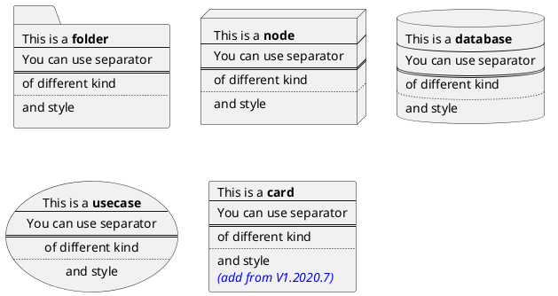

# Test

```echarts
{
  xAxis: {
    data: ['A', 'B', 'C', 'D', 'E']
  },
  yAxis: {},
  series: [
    {
      data: [10, 22, 28, 43, 49],
      type: 'bar',
      stack: 'x'
    },
    {
      data: [5, 4, 3, 5, 10],
      type: 'bar',
      stack: 'x'
    }
  ]
};
```




