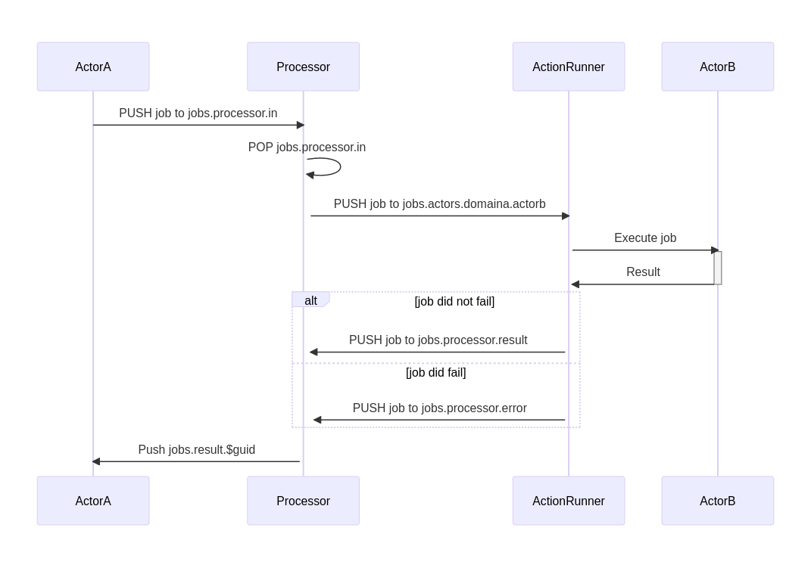
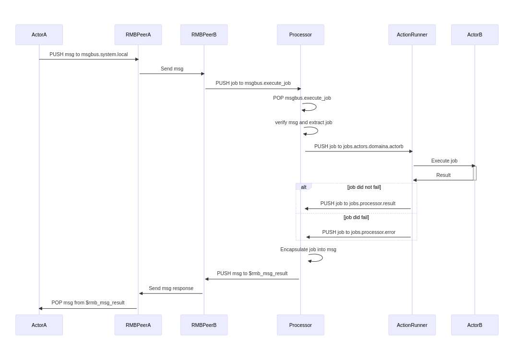

# Overview
Now that you know all components in baobab let's go over some sequence diagrams showing you the flow of jobs.

## Executing jobs inside the system 
The first case is executing jobs from another actor that is running on the same system. 

Below you can find a sequence diagram of the flow in such a case. First you can see that ActorA is pushing a job in the queue *jobs.processor.in* which the Processor will pop. It will extract the actor from the job and push it to its queue (*jobs.actors.domaina.actorb*). The actionrunner will notice this when popping the job and execute the execute method of ActorB. Remember that ActorB can fail running this method. If it fails the ActionRunner will push the job in the queue *jobs.processor.error*. If not it will push it in the queue *jobs.processor.result*. The Processor will pull from either queues and return the job to ActorA. Before doing that it will modify the state to either error or ok.

## Executing jobs outside the system 
The second case is executing jobs from another actor that is running on another system.

Below you can find a sequence diagram of the flow in such a case. First you can see that ActorA is pushing an RMB message to the queue *msgbus.system.local* which the rmb-peer running on system A will send to the rmb-peer running on system B. This last rmb-peer will push the message in the queue *execute_job* which the Processor will notice. The Processor will push this job to the actors' queue (*jobs.actors.domaina.actorb*). The ActionRunner will do its work and pop that job from the queue. It will execute the execute method of ActorB. If it fails the ActionRunner will push the job in the queue *jobs.processor.error*. If not it will push it in the queue *jobs.processor.result*. The Processor will pull from either queues and send back a response via RMB. It does that by pushing an RMB response message encapsulating the job in the queue that was specified in the incoming RMB message. The rmb-peer B will send the message to rmb-peer A which will push it to the response queue initially set by ActorA. ActorA can then retrieve the message and extract the job from it.

