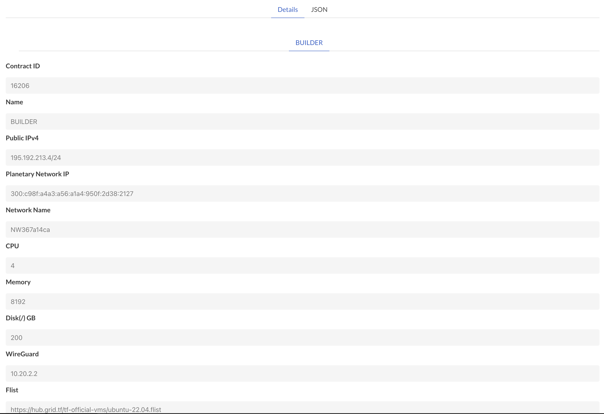

# Getting Started Ubuntu

## Deploy a VM on TFGrid

steps

- go to https://play.grid.tf/#/
- chose VM deployer, make sure to have some TFT in your wallet
- depoy an ubuntu 22.04
- make sure you chose pub IP address and you have your SSH key loaded
- I chose 200 GB of storage and 8 Gb of memory

result is something like

  

Login to your VM with

```bash
#the -A forwards your SSH key (important)
#the ip address is the address as given back by the deploy of the VM on threefold play
ssh -A root@195.192.213.4
```

## Prepare the VM

inside the VM do the following

### if you want to reinstall do

```bash
rm -rf /root/.vmodules
rm -f /root/env.sh
```

### install crystal lib

> THIS WILL ONLY WORK IF YOU LOGGED IN WITH YOUR SSH-AGENT AND SSHKEYS AS USED IN GITHUB LOADED and SSH -A was used

```bash
#if you want to reset and make sure all is clean (BE CAREFULL WILL REMOVE CODE DIRS)
export FULLRESET=1
#the next line is needed if you want to change a branch (first one is for crylstallib, 2nd builders)
export CLBRANCH=development
export BUILDERBRANCH=development
curl https://raw.githubusercontent.com/threefoldtech/builders/development/scripts/install.sh > /tmp/install.sh && bash /tmp/install.sh
```


## Builders

### our base dockers

```
v -cg run  /root/code/github/threefoldtech/builders/examples/base/vbuild_base.v
```


### an example server in golang

```
v -cg run /root/code/github/threefoldtech/builders/examples/goca/play_goca.v
```


## troubleshooting

### to make sure you are using the right branch of crystal and builder tools

```bash
export CLBRANCH=development
export BUILDERBRANCH=development
pushd ~/.vmodules/freeflowuniverse/crystallib && git pull && git checkout $CLBRANCH && popd
pushd ~/.vmodules/threefoldtech/builders && git pull && git checkout $BUILDERBRANCH && popd
```


