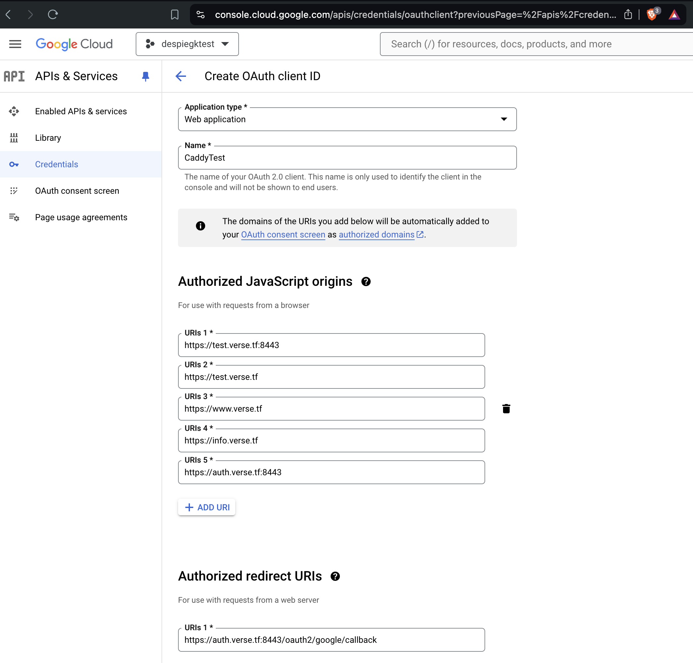
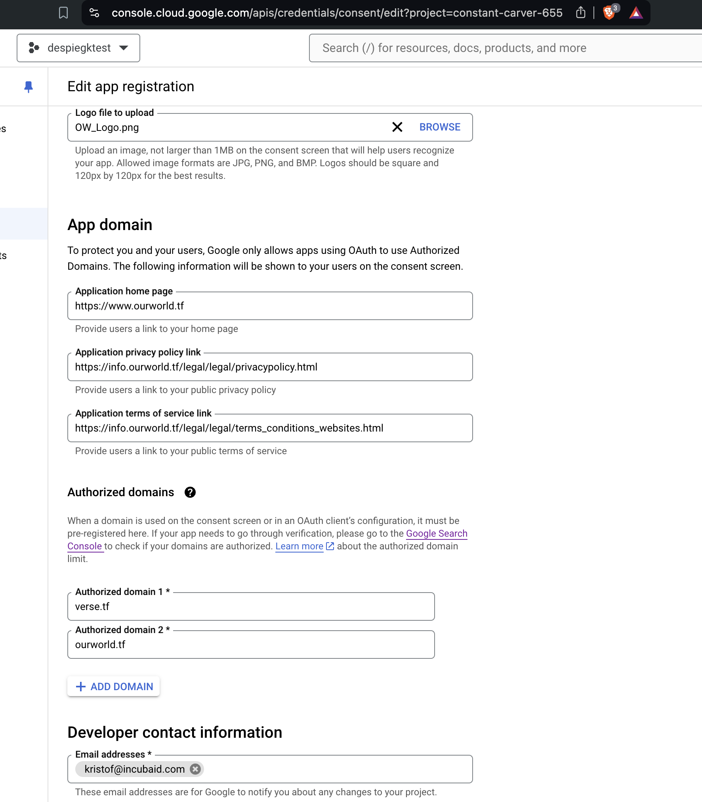

## Google OAuth



see https://console.cloud.google.com/apis/credentials/oauthclient




useful links

- https://info.ourworld.tf/legal/legal/terms_conditions_websites.html
- https://info.ourworld.tf/legal/legal/privacypolicy.html


can add users to test

- https://console.cloud.google.com/apis/credentials/consent?project=constant-carver-655

### example how to use in heroscript


```js

!!caddy.install
    xcaddy:true
    plugins:'github.com/mholt/caddy-webdav,github.com/mohammed90/caddy-git-fs,github.com/abiosoft/caddy-exec,github.com/greenpau/caddy-security'
    restart:true

!!session.env_set key:'JWT_SHARED_KEY' val:'...'

!!session.env_set key:'GOOGLE_CLIENT_SECRET' val:'...'

!!session.env_set key:'GOOGLE_CLIENT_ID' val:'...'

!!caddy.configure
    caddyfile:'Caddyfile'
    restart:true

```

The Caddyfile needs to be in same location then where this is run