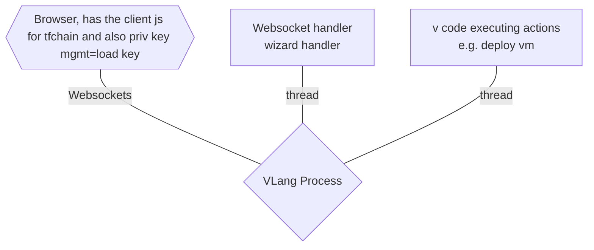

## Architecture

### OPTION FLOW 1

- start test.v
- test.v does following
    - start websocket/http server
    - opens browser to go to the home web page
    - wait for user to insert private key
    - now a wizard is shown which is driven by test.v
    - vm can be deployed
    - assets can be listed on TFChain
    - ...
- home web page does following
    - allow user to insert private key
    - allow user to select testnet, devnet, mainnet
    - load private key, test connection, show e.g. assets 
    - now the client for TFChain, ... is loaded listening to websockets
    - now the wizard framework is loaded to allow the test.v to drive interaction

### OPTION FLOW 2

- start test2.v
- test2.v does following
    - start websocket/http server
    - opens browser to go to the home web page
    - test2.v uses client to websocket internal server to initialize private key for tfchain as well as chose which net e.d. devnet, this client will wait till browser loaded the home web page
    - now a wizard is shown which is driven by test2.v
    - vm can be deployed
    - assets can be listed on TFChain
    - stellar private key can be loaded, money transfered, ... from test2.v
    - ...
- home web page does following
    - the client for TFChain, ... is loaded listening to websockets
    - the wizard framework is loaded to allow the test.v to drive interaction
    - the user does not have to do anything on the webpage, its all driven from the test2.v, even loading of private key, especially important for development

### OPTION FLOW 3

- start test3.v
- test3.v does following
    - start websocket/http server
    - opens browser to go to the home web page
    - browser authenticates tfconnect (see below)
    - ...
- home web page does following
    - the client for TFChain, ... is loaded listening to websockets
    - the wizard framework is loaded to allow the test.v to drive interaction
    - through tfconnect private keys are loaded 
        - stellar (optional)
        - tfchain
        - choose which net
    - the user has to choose which key(s) to load
    - now the webpage is ready with all private keys required
    - wizards... can work

### remarks

- the minimized required js code for all of this to work is somewhere available to be used without having to do npm, yarn, ... there should be no nodejs required to get started from vlang allone (unless if ofcourse the javascript part needs to be changed)